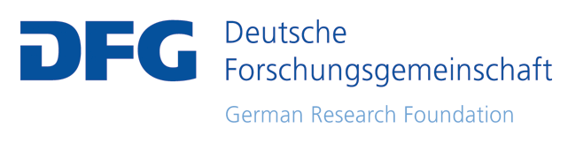

---
# Feel free to add content and custom Front Matter to this file.
# To modify the layout, see https://jekyllrb.com/docs/themes/#overriding-theme-defaults

layout: home
---

The Tübingen Archive of Language Resources [(enter here)](https://talar.sfb833.uni-tuebingen.de:8443/erdora/ "Enter Repository") has received funding from the the following research organisations:

